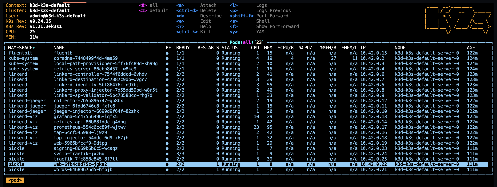
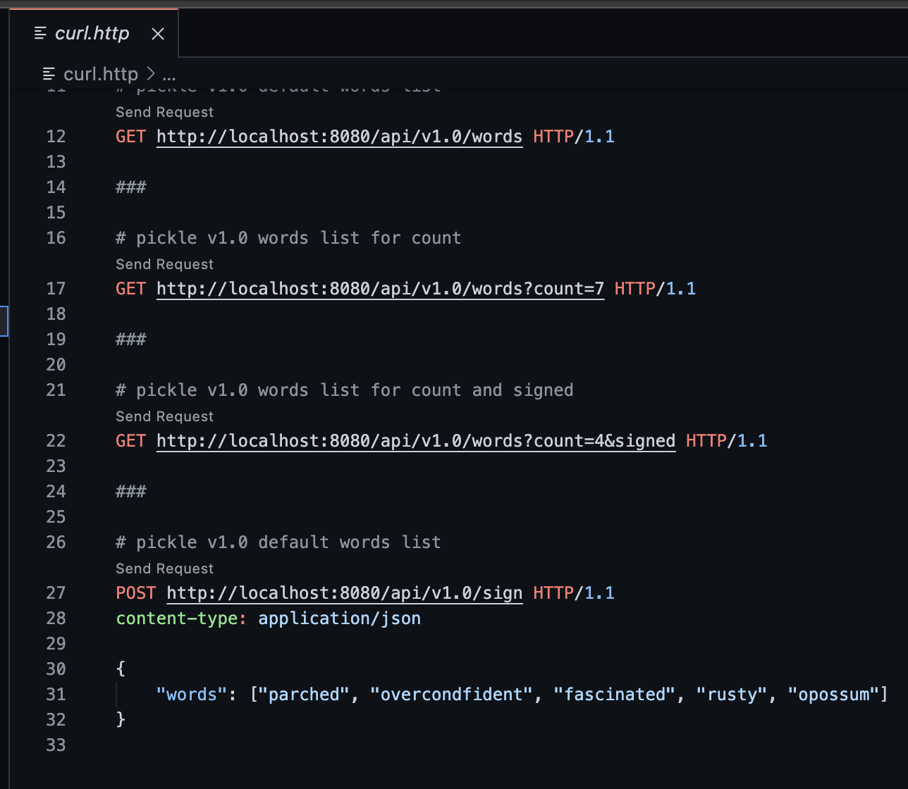
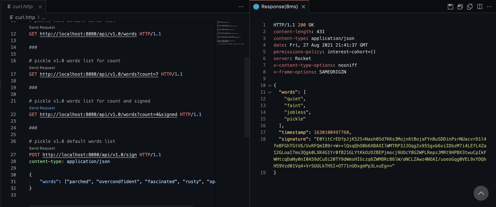
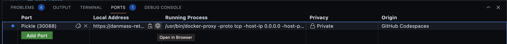

# Kubernetes linkerd, Rust, and grpc Codespace

This project is an inner loop Kubernetes development example, using `k3d` running in [GitHub Codespaces](https://github.com/features/codespaces), created from [Kubernetes Dev Cluster on Codespaces Template](https://github.com/retaildevcrews/kind-k3d-codespaces-template).

[License](https://img.shields.io/badge/license-MIT-green.svg)

The opentelemetry-rust code in the app/rust/b3 crate is licensed under the
[Apache License 2.0](https://github.com/open-telemetry/opentelemetry-rust/blob/main/LICENSE),
a permissive license whose main conditions require preservation of copyright and license notices.
Contributors provide an express grant of patent rights. Licensed works, modifications, and larger
works may be distributed under different terms and without source code

## Overview

This project sets up a Kubernetes developer cluster using `K3d` with linkerd in a `GitHub Codespace` or local `Dev Container`.

We use this for `inner-loop` Kubernetes development. Note that it is not appropriate for production use (but is a great `Developer Experience`)

> This Codespace is tested with `zsh` and `oh-my-zsh` - it "should" work with bash ...

## Software Used

This project demonstrates several open source projects used in combination.

- [K3s](https://k3s.io/):Lightweight [Kubernetes](https://kubernetes.io/)
- [K3D](https://k3d.io/): K3s in Docker
- [Docker](https://www.docker.com/), including [Docker Compose](https://docs.docker.com/compose/)
- [Linkerd](https://linkerd.io/) service mesh, configured with
  - [Prometheus](https://prometheus.io/) for monitoring
  - [Grafana](https://grafana.com/) for observability
  - [Jaeger](https://www.jaegertracing.io/) for distributed tracing
- [Traefik](https://traefik.io/) for ingress and initial trace span creation
- [Helm](https://helm.sh/) is used to deploy Traefik
- [Rust](https://www.rust-lang.org/) is the language used to write the example services. Important crates used include
  - [tonic](https://crates.io/crates/tonic) for [grpc](https://grpc.io/) support
  - [rocket](https://rocket.rs/) web framework
  - [opentelemetry](https://crates.io/crates/opentelemetry) and [opentelemetry-jaeger](https://crates.io/crates/opentelemetry-jaeger) for distributed tracing
  - [okapi](https://crates.io/crates/okapi) for web api documentation
  - [ring](https://crates.io/crates/ring) for cryptographic signing
  - [structopt](https://crates.io/crates/structopt) for command line argument handling
- [Fluent Bit](https://fluentbit.io/) for log handling
- [k9s](https://k9scli.io/) terminal UI for Kubernetes
- [GitHub](https://github.com/) [Codespaces](https://github.com/features/codespaces)
_ [GNU Make](https://www.gnu.org/software/make/)

## A Note on Secret Handling

This project uses a Codespaces secret `PICKLE_PRIVATE_KEY` to store a base64-encoded RSA PSS DER certificate to use in the Codespaces
environment. The key file is copied into an image file as part of the build. In a production or integration environment, the key would
be provided via a secure secrets store, like [Azure Key Vault](https://azure.microsoft.com/en-us/services/key-vault/).

## Open with Codespaces

- Click the `Code` button on your repo
- Click `Open with Codespaces`
- Click `New Codespace`
- Choose the `8 core` or `4 core` option

## Build and Deploy Cluster

This project uses `make` to drive K3s cluster creation and setup and to build and deploy the services in the app. Some of the
Linkerd-related images can go to `ImagePullBackoff` when installing Linkerd and its add-ons. The make file provides targets to
pre-load the images in the local docker cache and the registry built into the K3s cluster.

`make bootstrap` will delete any existing K3s cluster, pull the Linkerd-related images, create a K3s cluster, import the images into the
K3s cluster's registry, and then setup Linkerd and its add-ons. When that is done, you will have a K3s cluster ready to host the services.

`make loop` (short for dev inner loop) will build the services, create the container images for them, deploy them in the cluster, and setup
Traefik ingress in the namespace.

## Validate deployment with k9s

- From the Codespace terminal window, start `k9s`
  - Type `k9s` and press enter
  - Press `0` to select all namespaces
  - Wait for all pods to be in the `Running` state (look for the `STATUS` column)
  - Use the arrow key to select `pickle  web-...` then press the `l` key to view logs from the pod
  - To go back, press the `esc` key
  - To view other deployed resources - press `shift + :` followed by the deployment type (e.g. `secret`, `services`, `deployment`, etc).
  - To exit - `:q <enter>`

## Interesting Endpoints

Open [curl.http](./curl.http)

> [curl.http](./curl.http) is used in conjuction with the [Visual Studio Code](https://code.visualstudio.com/)
[REST Client](https://marketplace.visualstudio.com/items?itemName=humao.rest-client) extension.
>
> When you open [curl.http](./curl.http), you should see a clickable `Send Request` text above each of the URLs

Clicking on `Send Request` should open a new panel in Visual Studio Code with the response from that request like so:

## Ports

Click on the `PORTS` tab in the lower panel. The Codespace has one port mapped to the Traefik ingress for the app.

Choose "Open in Browser" on the "Pickle (30088)" row. When your browser lands on the root page for the app, click the "Swagger docs" link to try out the API.

## Linkerd, Grafana, and Jaeger views

## Quick Tour

## Next Steps

> [Makefile](./Makefile) is a good place to start exploring

## Jump Box

A `jump box` pod is created so that you can execute commands `in the cluster`

- use the `kj` alias
  - `kubectl exec -it jumpbox -- bash -l`
    - note: -l causes a login and processes `.profile`
    - note: `sh -l` will work, but the results will not be displayed in the terminal due to a bug

- use the `kje` alias
  - `kubectl exec -it jumpbox --`
- example
  - run http against the ClusterIP
    - `kje http ngsa-memory:8080/version`

## View Fluent Bit Logs

- Start `k9s` from the Codespace terminal
- Select `fluentb` and press `enter`
- Press `enter` again to see the logs
- Press `s` to Toggle AutoScroll
- Press `w` to Toggle Wrap
- Review logs that will be sent to Log Analytics when configured

## Troubleshooting

## Trademarks

This project may contain trademarks or logos for projects, products, or services.

Authorized use of Microsoft trademarks or logos is subject to and must follow [Microsoft's Trademark & Brand Guidelines](https://www.microsoft.com/en-us/legal/intellectualproperty/trademarks/usage/general).

Use of Microsoft trademarks or logos in modified versions of this project must not cause confusion or imply Microsoft sponsorship.

Any use of third-party trademarks or logos are subject to those third-party's policies.
