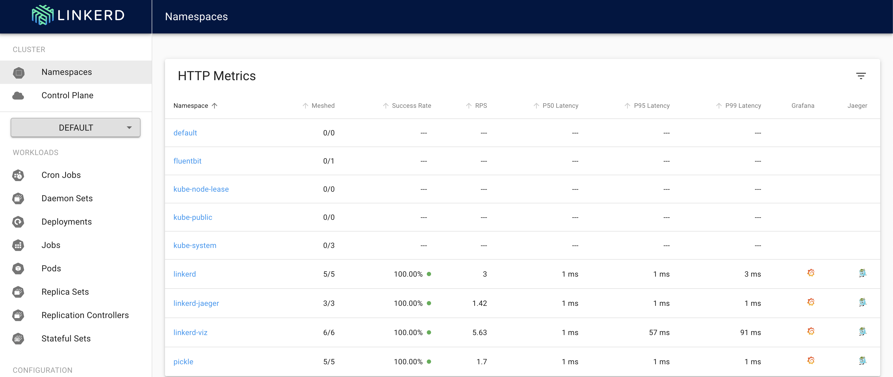

# Kubernetes, Linkerd, Rust, and grpc in GitHub Codespaces

This project is an inner-loop Kubernetes development example, using k3d running in [GitHub Codespaces](https://github.com/features/codespaces), created from [Kubernetes Dev Cluster on Codespaces Template](https://github.com/cse-labs/kubernetes-in-codespaces).

The opentelemetry-rust code in the `app/rust/b3` package is licensed under the
[Apache License 2.0](https://github.com/open-telemetry/opentelemetry-rust/blob/main/LICENSE),
a permissive license whose main conditions require preservation of copyright and license notices.
Contributors provide an express grant of patent rights. Licensed works, modifications, and larger
works may be distributed under different terms and without source code

## Overview

This project sets up a Kubernetes developer cluster using k3d with Linkerd in a GitHub Codespace or local Dev Container.

We use this for inner-loop Kubernetes development. Note that it is not appropriate for production use (but is a great Developer Experience).

> This Codespace is tested with `zsh` and `oh-my-zsh` - it "should" work with `bash` ...

## Software Used

This project demonstrates several open source projects used in combination.

- [K3s](https://k3s.io/): Lightweight [Kubernetes](https://kubernetes.io/)
- [k3d](https://k3d.io/): K3s in Docker
- [Docker](https://www.docker.com/), including [Docker Compose](https://docs.docker.com/compose/)
- [Linkerd](https://linkerd.io/) service mesh, configured with
  - [Prometheus](https://prometheus.io/) for monitoring
  - [Grafana](https://grafana.com/) for observability
  - [Jaeger](https://www.jaegertracing.io/) for distributed tracing
- [Traefik](https://traefik.io/) for ingress and initial trace span creation
- [Helm](https://helm.sh/) is used to deploy Traefik
- [Rust](https://www.rust-lang.org/) is the language used to write the example services. Important crates used include
  - [tonic](https://crates.io/crates/tonic) for [grpc](https://grpc.io/) support
  - [rocket](https://rocket.rs/) web framework
  - [opentelemetry](https://crates.io/crates/opentelemetry) and [opentelemetry-jaeger](https://crates.io/crates/opentelemetry-jaeger) for distributed tracing
  - [okapi](https://crates.io/crates/okapi) for web api documentation
  - [ring](https://crates.io/crates/ring) for cryptographic signing
  - [structopt](https://crates.io/crates/structopt) for command line argument handling
- [Fluent Bit](https://fluentbit.io/) for log handling
- [k9s](https://k9scli.io/) terminal UI for Kubernetes
- [GitHub](https://github.com/) [Codespaces](https://github.com/features/codespaces)
- [GNU Make](https://www.gnu.org/software/make/)

## A Note on Secret Handling

This project uses a Codespaces secret `PICKLE_PRIVATE_KEY` to store a base64-encoded RSA PSS DER certificate to use in the Codespaces
environment. The key file is copied into an image file as part of the build. In a production or integration environment, the key would
be provided via a secure secrets store, like [Azure Key Vault](https://azure.microsoft.com/en-us/services/key-vault/).

## Open with Codespaces

- Click the `Code` button on your repo
- Click `Open with Codespaces`
- Click `New Codespace`
- Choose the `8 core` or `4 core` option

## Build and Deploy Cluster

This project uses `make` to drive K3s cluster creation and setup and to build and deploy the services in the app. Some of the
Linkerd-related images can go to `ImagePullBackoff` when installing Linkerd and its extensions. The make file provides targets to
pre-load the images in the local docker cache and the registry built into the K3s cluster.

`make bootstrap` will delete any existing K3s cluster, pull the Linkerd-related images, create a K3s cluster, import the images into the
K3s cluster's registry, and then setup Linkerd and its extensions. When that is done, you will have a K3s cluster ready to host the services.

`make loop` (short for dev inner loop) will build the services, create the container images for them, deploy them in the cluster, and setup
Traefik ingress in the namespace.

## Validate deployment with k9s

- From the Codespace terminal window, start `k9s`
  - Type `k9s` and press enter
  - Press `0` to select all namespaces
  - Wait for all pods to be in the `Running` state (look for the `STATUS` column)
  - Use the arrow key to select `pickle  web-...` then press the `l` key to view logs from the pod
  - To go back, press the `esc` key
  - To view other deployed resources - press `shift + :` followed by the deployment type (e.g. `secret`, `services`, `deployment`, etc).
  - To exit - `:q <enter>`

## Interesting Endpoints

Open [curl.http](./curl.http)

> [curl.http](./curl.http) is used in conjuction with the [Visual Studio Code](https://code.visualstudio.com/)
[REST Client](https://marketplace.visualstudio.com/items?itemName=humao.rest-client) extension.
>
> When you open [curl.http](./curl.http), you should see a clickable `Send Request` text above each of the URLs

Clicking on `Send Request` should open a new panel in Visual Studio Code with the response from that request like so:

Try all of the requests to see the different results.

## Ports

Click on the `PORTS` tab in the lower panel. The Codespace has one port mapped to the Traefik ingress for the app.

Choose "Open in Browser" on the "Pickle (30088)" row. When your browser lands on the root page for the app, click the "Swagger docs" link to try out the API. Exercise the API with some example calls. Distributed trace sampling is set to 50% in the app, so make 2-3 calls with each end point to make sure there is data to visualize later.

## Linkerd, Grafana, and Jaeger views

In this project, Linkerd is setup with its viz and jaeger extensions. The easiest way to see the visualizations is to type `linkerd viz dashboard` in the `TERMINAL` window.

Follow the link in the last line of the output to see the main Linkerd dashboard.

From here, you can explore the telemetry and visualizations baked into Linkerd and its exensions. Clicking on the "pickle" link at the bottom of the "HTTP Metrics" panel will show the information for the "pickle" deployments, as below.

Clicking on the logo links to the far right of any deployment will open the associated Grafana and Jaeger views.

The sampling rate for distributed tracing is set to 50%, so you will see entries for only some of the calls you made to the service. Click on a trace to see the more detailed view.

## Next Steps

Click around the Linkderd dashboard and the Grafana and Jaeger views.

> [Makefile](./Makefile) is a good place to start exploring the project

## Quick Tour of the Project

`[Makefile](.Makefile)` drives creating and setting up the cluster and building and deploying the services in the app. The deploy directory
includes the configuratioin and installation assets for k3d, Linkerd, Traefik, and Fluent Bit. [instal_linkerd.sh](./deploy/linkerd/install_linkderd.sh)
is a specific version of the Linkerd installer that comes from [https://run.linkerd.io/install](https://run.linkerd.io/install). The images cached by
`make pull` and `make prime` correspond to the version of Linkerd installed by this file. [traefik_values.yaml](./deploy/traefik/traefik_values.yaml)
is provided to the Traefik Helm chart to setup Traefik ingress with [b3](https://github.com/openzipkin/b3-propagation) trace initiation to the common
Jaeger collector.

The `app` directory includes the [Docker Compose](./app/docker-compose.yml) file to create all three service images from the Dockerfile's in the directory.
The Dockerfiles build in a [rust-slim image](https://hub.docker.com/_/rust) with [musl](https://musl.libc.org/) to support static linking and running on
[Alpine](https://hub.docker.com/_/alpine) images. The Dockerfiles are constructed to allow for caching of dependencies in image layers.

The `rust` directory under `app` is the [Cargo](https://doc.rust-lang.org/cargo/) [workspace](https://doc.rust-lang.org/cargo/reference/workspaces.html) that includes the five Rust packages that make up the application. `b3` is a package of helper methods to support b3 span propagation for distributed
tracing. `dill` is the package that builds a libary based on the grpc proto definition. `pickle` is the web front end for the application based on
the Rocket web framework. It implements a simple rpc API over HTTP. `words` is a grpc service that returns lists of words. `signer` will add a
timestamp and signature to a list of words.

## Jump Box

A `jump box` pod is created so that you can execute commands `in the cluster`

- use the `kj` alias
  - `kubectl exec -it jumpbox -- bash -l`
    - note: -l causes a login and processes `.profile`
    - note: `sh -l` will work, but the results will not be displayed in the terminal due to a bug

- use the `kje` alias
  - `kubectl exec -it jumpbox --`
- example
  - run http against the ClusterIP
    - `kje http ngsa-memory:8080/version`

## View Fluent Bit Logs

- Start `k9s` from the Codespace terminal
- Select `fluentb` and press `enter`
- Press `enter` again to see the logs
- Press `s` to Toggle AutoScroll
- Press `w` to Toggle Wrap
- Review logs that will be sent to Log Analytics when configured

## Troubleshooting

### ImagePullBackoff problems with Linkerd-related images

Run `make pull` and then `make prime` or just run `make bootsrap` to start over. Either approach will pull down the required images
and push them into the local cluster's image registry.

### Signing service crashes on start

The most likely reason for this is a missing signing key. Make sure you have an RSA PSS private key base64-encoded from DER format
in a GitHub Codespace secret called `PICKLE_PRIVATE_KEY`. Run `devcontainer/post-start.sh` You can look at the logs to see what
the issue is.

### Not seeing distributed traces in Jaeger

In the `deploy\traefik\traefik_values.yaml` file Traefik is configured for a probabilistic sample rate of .5. Invoke the app more times via
the `curl.http` file or the swagger web UI or change the sample rate to record a higher number of requests, start over with `make all` or `make allp`,
and then exercise the app again to create new traces.

## Trademarks

This project may contain trademarks or logos for projects, products, or services.

Authorized use of Microsoft trademarks or logos is subject to and must follow [Microsoft's Trademark & Brand Guidelines](https://www.microsoft.com/en-us/legal/intellectualproperty/trademarks/usage/general).

Use of Microsoft trademarks or logos in modified versions of this project must not cause confusion or imply Microsoft sponsorship.

Any use of third-party trademarks or logos are subject to those third-party's policies.
